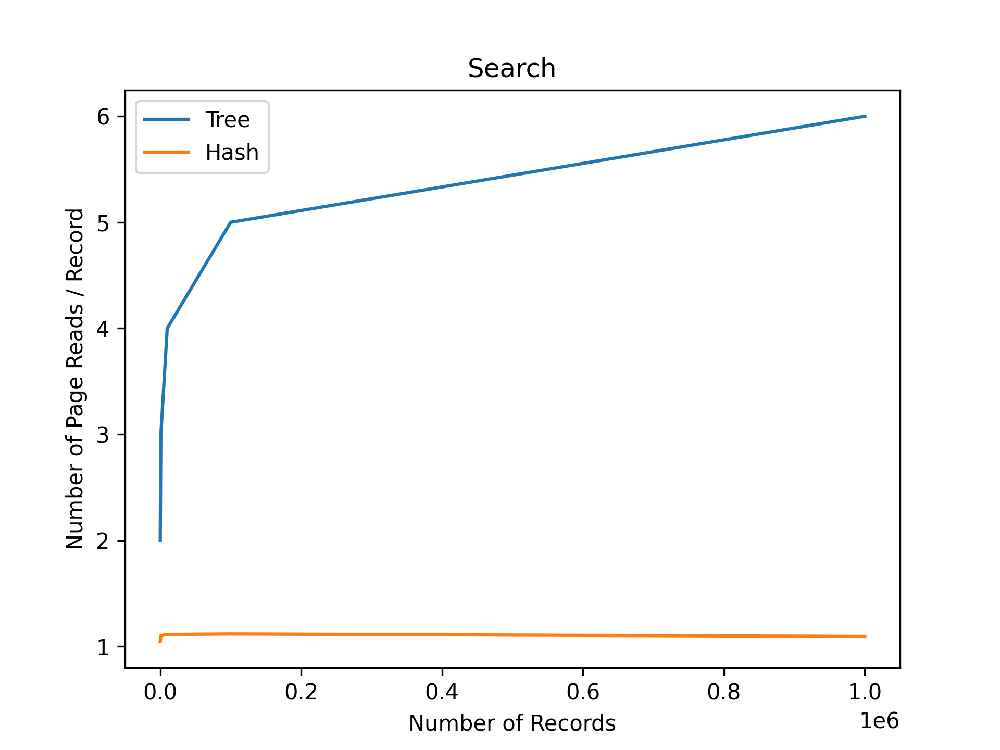
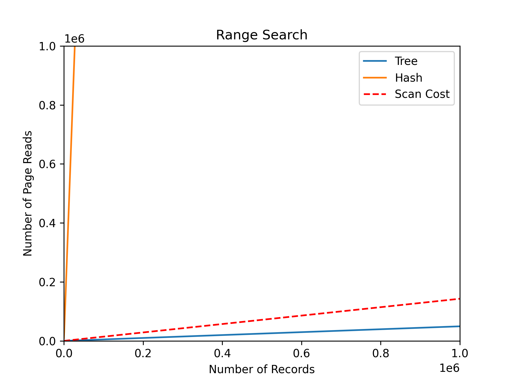

# DBMS-Implementation
## Empirically Benchmarking Tree-based and Hash-based Database Implementations
### To compile the program: 
```zsh
$ make
```

### To run the benchmark:
```zsh
$ ./benchmark.e <number of records to insert into data structures -- defaults to 150>
```
### Goal / Approach
For the CPS377 Final Project we developed a C implementation of a Linear Hash Table and a B+-Tree to compare their benefits and downsides. We expected to demonstrate that B+-trees are better at range queries and hash tables are better optimized for key equality searches.

### Page Simulation Design

Directly collecting data on page hits was infeasible for a number of reasons, primarily time: such data would require manipulation of the Linux kernel to collect, which would have added unrealistic amounts of work to the project. Moroever, we wanted to be able to modify the page size so that we could test in small scale and benchmark across a variety of page sizes. We thus needed a way to simulate page fetching within the program itself. The solution to this is the `pageManager` struct, which is a simple set of counters for reads and writes. Pages were abstracted to a `pageptr` struct, which contains a union of the various type of pages in play (hash buckets, tree nodes, tree leaf nodes, record pages) and a signifier to denote which type that particular pointer refers to. The data structures were then implemented based on this abstracted `pageptr`, and the algorithms call the `pageManager` every time they perform an action that would require fetching a new page (e.g. going to a bucket or traversing to a tree node).

The "page" size can then be set at compile time with a pre-processing directive, with the sizes of the individual types of pages calculated based on the sizes of their component structs; so a tree node, composed of a 64-bit int and an array of key/pointer unions contains as many of those unions as fit in the page size, rounded down to an odd number.  This arithmetic was the source of a number of very difficult errors to chase down, as it relies on certain assumptions about the sizes of various structs that may be invalidated based on how the C compiler packs members into a struct; this caused a number of memory errors, and so led to the implementation of a `checkSizes` function that compares the expected values against the actual at the initalization of the page manager and terminates the program if the values disagree.
 
### Results

Our prediction from our project proposal (like the theory suggests) that hash tables are better optimized for key equality searches ([Figure 1](Documents/searchReadsPlot.png)) and that B+-trees are better at range queries ([Figure 2](Documents/rangeSearchReadsPlot.png)), was supported empirically by our benchmarked results.

#### Search

Figure [Figure 1](Documents/searchReadsPlot.png) demonstrates the performance of a key equality searches of the entire data structure for both the the linear hash and tree implementation. The hash table performs better than the tree for key equality searches. This, of course, makes sense because in key equality searches the tree cannot benefit from the links between the leaf nodes like it does in range search. The hash table performs roughly 4 times better than the tree on average. Key equality search is the worst case for tree-based databases. 

#### Range Search

Figure [Figure 2](Documents/rangeSearchReadsPlot.png) demonstrates the performance of a range query of the entire data structure for both the the linear hash and tree implementation. The tree performs \textbf{overwhelming} better than the hash table for range searches, the performance gap is so wide that it helps to look at the same plot but with a logarithmically scaled x-axis (Figure \ref{fig:rangeSearchLog}). Range search is the worst case for hash-based databases. 

The expected numbers are fairly similar. We ran these tests using a 512-byte page. This means that one tree page can hold 31 key/pointer unions, or 16 pointers. If we assume 75% occupancy, this means each tree node holds roughly 12 children; the height of the tree should therefore be log12(1,000,000) = 5.5 ≈ 6. We would therefore expect around 6 reads per search, or 6,000,000 reads to search for 1,000,000 items.

The textbook estimates 1.2 reads per search for a hash map. We would therefore expect it to take around 1,200,000 reads to search for 1,000,000 items.

For the range searches, the tree ought to perform basically the same: it should still take 6 I/Os to traverse down to the beginning of the range, but will then require an additional few I/Os to traverse the linked list. One of those pages can hold 29 rids, so again assuming 75% occupancy it should take 6 + n/21.75 page I/Os to retrieve n records (plus one or two pages because we won’t be going cleanly from the beginning of one page to the end of another). We would therefore expect the second quartile range search to take 6 + 250,000/21.75 = 11,500 reads and the full range search to take 6 + 1,000,000/21.75 = 45, 983.

The hash table, on the other hand, does not store any information on record order; therefore, to perform a range search using the table, one must simply check the table for every potential key in the range. The skewed data ranges from 0 to 100,204,720, with the second quartile beginning at 32,797,249 and ending at 50,173,927. Again assuming 1.2 reads per search, this should take 120,245,644 reads to perform the full range search and 20,852,013 reads for the second quartile.

The experimental data (see below) basically confirm these estimates. The tree slightly under- performs them for range searches, while the hash table slightly overperforms them overall. The hash performance is probably due to the evenness of the data: even with a skew applied, it still experiences rel- atively little overflow. In a real-world database with records being added and removed regularly, we would expect worse performance. The tree performance is probably due to lower occupancy than expected. This could be improved by a more aggressive splitting technique that reallocates to existing sibling nodes if possible instead of splitting; however, all of these variances are fairly trivial, and we can see clearly from this data that the expected performance basically aligns with the experimental performance.





Linear Hash Table Operation  | Reads         | Writes         | Est. Reads
---------------------------- | ------------- | -------------  | -------------
Insert                       | 3,223,374     | 2,857,734      | - 
Full Key Equality Search     | 1,095,543     | 0              | 1,200,000
Second Quartile Range Search | 17,703,231    | 0              | 20,852,013 
Full Range Search            | 102,532,199   | 0              | 120,245,644 


Tree Operation               | Reads         | Writes         | Est. Reads
---------------------------- | ------------- | -------------  | -------------
Insert                       | 4,361,765     | 1,250,899      | - 
Full Key Equality Search     | 6,000,000     | 0              | 6,000,000
Second Quartile Range Search | 12,368        | 0              | 11,500
Full Range Search            | 49,310        | 0              | 45,983


